#  Writeup for the FCND-Estimation-CPP project

fixed output window size, using the advice from https://knowledge.udacity.com/questions/292314

# Step 1: Sensor Noise (Scenario 6)

The task is to process the logged files from the simulation to calculate the standard deviation of the GPS X signal and the IMU Accelerometer X signal.

To accomplish this I wrote a little python script parsing and evaluating the log files:

```
import numpy as np

# calculate standard deviation from a series of measurements
# 1. gps x coordinate
gps_x_data = np.genfromtxt('Graph1.txt', delimiter=',', skip_header=1)
x = gps_x_data[:,1]
stdDev = np.std(x, axis = 0)
print(f'StdDev GPS X Position: {stdDev}')

# 2. accelerometer x acceleration
acc_ax_data = np.genfromtxt('Graph2.txt', delimiter=',', skip_header=1)
ax = acc_ax_data[:,1]
stdDev = np.std(ax, axis = 0)
print(f'StdDev Accelerometer X Acceleration: {stdDev}')
```
The result for a simulation of more than 10 seconds was:
* StdDev GPS X Position: 0.7017824842601307 (SimulatedSensors.txt: 0.7)
* StdDev Accelerometer ax: 0.5093821200191182 (SimulatedSensors.txt: 0.5) 

With these values inserted, the dashed lines turned green to signal that approx. 68% of the measurements are within the interval defined by the standard deviation:

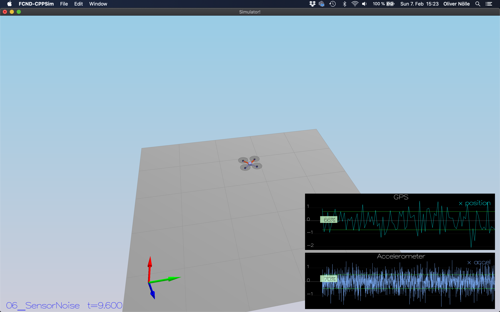

# Step 2: Attitude Estimation (Scenario 7)

The task is to improve estimation with a better rate gyro attitude integration scheme in the complementary filter.

To do this, I implemented an integration based on a quaternion representation in the inertial frame.
Then, the body rate from the gyro can be integrated in that representation to get the updated pitch, roll, and yaw values.
The changed implementation part within QuadEstimatorEKF.cpp looks like this:
```
Quaternion<float> attitude = Quaternion<float>::FromEuler123_RPY(rollEst, pitchEst, ekfState(6));
attitude.IntegrateBodyRate(gyro, dtIMU);

float predictedPitch = attitude.Pitch();
float predictedRoll = attitude.Roll();
ekfState(6) = attitude.Yaw();
```

With this improved attitude estimation, the attitude error is within 0.1 rad for more than 3 seconds:

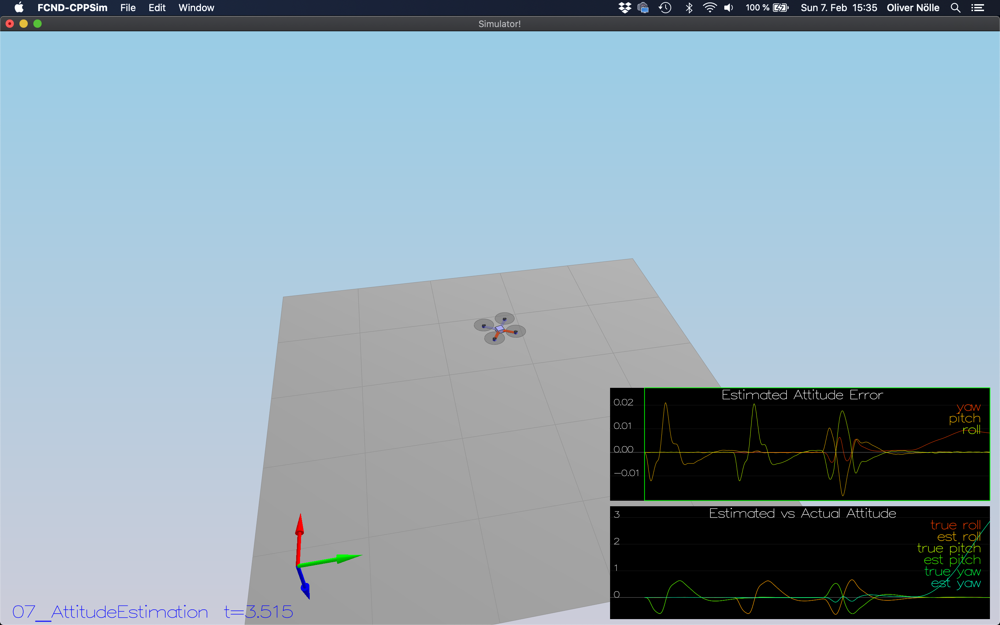

# Step 3: Prediction Step (Scenarios 8-?)

The task is to implement the prediction step of the Kalman filter.

## Subtask: transition function, state prediction (Scenario 8)
To accomplish this, the transition function in PredictState() calculates the pose and velocities using a simple integration, based on the assumption that dt is small:
```
////////////////////////////// BEGIN STUDENT CODE ///////////////////////////
  predictedState(0) = curState(0) + curState(3) * dt; // x = x + x_dot * dt
  predictedState(1) = curState(1) + curState(4) * dt; // y = y + y_dot * dt
  predictedState(2) = curState(2) + curState(5) * dt; // z = z + z_dot * dt
  
  // convert true acceleration from body frame to global/inertial frame
  V3F acc_inertial = attitude.Rotate_BtoI(accel);

  predictedState(3) = curState(3) + acc_inertial.x * dt; // change in velocity along x = a_x * dt
  predictedState(4) = curState(4) + acc_inertial.y * dt; // change in velocity along y = a_y * dt
  predictedState(5) = curState(5) + acc_inertial.z * dt - CONST_GRAVITY * dt; // change in velocity along z = a_z * dt - gravity_component

/////////////////////////////// END STUDENT CODE ////////////////////////////
```

With this state prediction, the estimator keeps track of the current state with only a reasonable drift:

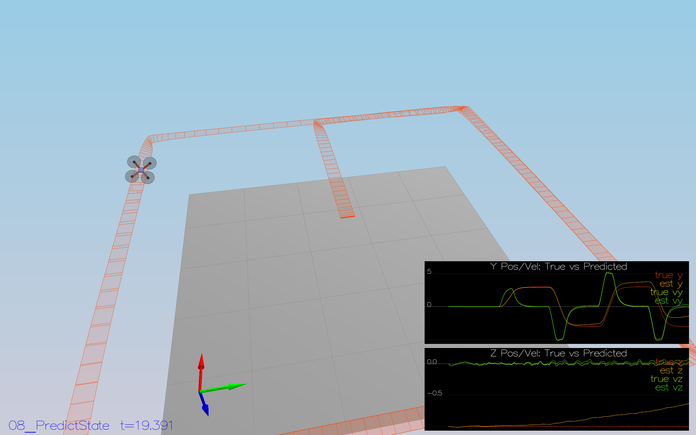

## Subtask: Covariance prediction (Scenario 9)
To calculate the partial derivative of the body-to-global rotation matrix in the function GetRbgPrime(), I implemented equation (52) from the estimation paper:
```
////////////////////////////// BEGIN STUDENT CODE ///////////////////////////
  // implements equation (52) from the estimation paper (theta = pitch, phi = roll, psi = yaw)
  RbgPrime(0, 0) = -cos(pitch) * sin(yaw);
  RbgPrime(0, 1) = -sin(roll) * sin(pitch) * sin(yaw) - cos(roll) * cos(yaw);
  RbgPrime(0, 2) = -cos(roll) * sin(pitch) * sin(yaw) + sin(roll) * cos(yaw);

  RbgPrime(1, 0) = cos(pitch) * cos(yaw);
  RbgPrime(1, 1) = sin(roll) * sin(pitch) * cos(yaw) - cos(roll) * sin(yaw);
  RbgPrime(1, 2) = cos(roll) * sin(pitch) * cos(yaw) + sin(roll) * sin(yaw);
/////////////////////////////// END STUDENT CODE ////////////////////////////
```

With that function implemented, I implemented the Predict() function following equation(51) to predict the state covariance forward:

```
////////////////////////////// BEGIN STUDENT CODE ///////////////////////////
  // equation (51): calculate the derivative of transition function: G_t = g'(u_t, x_t, \Delta t) -> eq. 51
  gPrime(0,3) = dt;
  gPrime(1,4) = dt;
  gPrime(2,5) = dt;

  gPrime(3, 6) = (RbgPrime(0) * accel).sum() * dt;
  gPrime(4, 6) = (RbgPrime(1) * accel).sum() * dt;
  gPrime(5, 6) = (RbgPrime(2) * accel).sum() * dt;

  // calculate the covariance: \bar{\Sigma}_t = G_t\Sigma_{t-1}G_t^T + Q_t
  MatrixXf term_1 = gPrime * ekfCov;
  gPrime.transposeInPlace();
  ekfCov = term_1 * gPrime + Q;

/////////////////////////////// END STUDENT CODE ////////////////////////////
```

Tuning the parameters to these values:
````
QPosXYStd = .05
QVelXYStd = .3
````
results in a reasonable approximation of the errors regarding x and velocity of x, judging from these sample plots (I prolonged simulation time to 4 seconds to illustrate it better): 
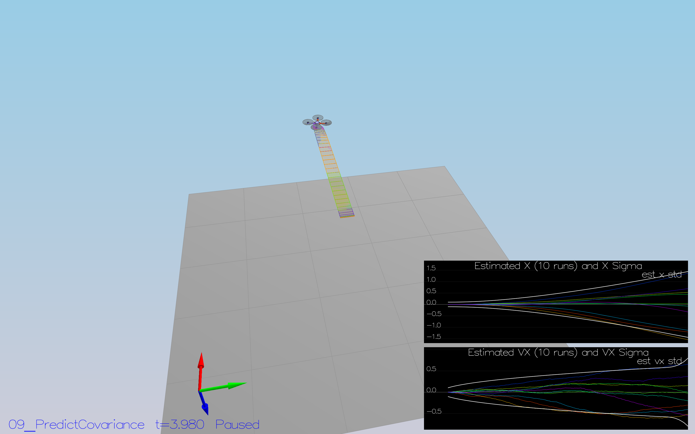

# Step 4: Magnetometer Update
## Tune the parameter QYawStd
In my simulation setting QYawStd to 0.01 resulted in this behavior, where the std deviation captures 81% of the values.

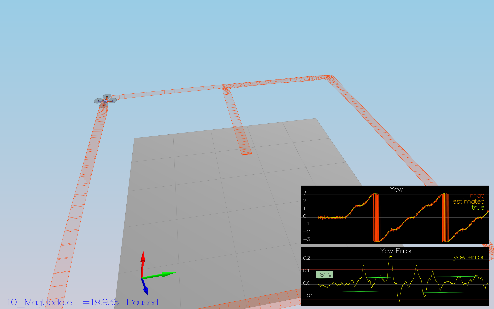

However, with my current tuning parameters configuration I could not reproduce the drift of the yaw error over time as described in the project readme:
```
QPosXYStd = .05
QPosZStd = .05
QVelXYStd = .3
QVelZStd = .1
QYawStd = .01
```

The implementation of the UpdateFromMag() method follows section 7.3.2 of the estimation paper:
```
////////////////////////////// BEGIN STUDENT CODE ///////////////////////////

  // section 7.3.2 estimation paper, equations 56 - 58
  // equation (58)
  hPrime(0, 6) = 1.;

  zFromX(0) = ekfState(6);
  float diffYaw = magYaw - ekfState(6);
  if ( diffYaw > F_PI ) {
      zFromX(0) += 2.f * F_PI;
  } else if ( diffYaw < -F_PI ) {
      zFromX(0) -= 2.f * F_PI;
  }
  
/////////////////////////////// END STUDENT CODE ////////////////////////////

```
For successfully completing the scenario, I had to tune th QYawStd parameter again to .09, so the resulting tuning parameters were:
```
QPosXYStd = .05
QPosZStd = .05
QVelXYStd = .3
QVelZStd = .1
QYawStd = .09

# GPS measurement std deviations
GPSPosXYStd = 1
# was: 3
GPSPosZStd = 300
GPSVelXYStd = .1
GPSVelZStd = .3
```
This configuration yielded a successful completion of scenario 10:
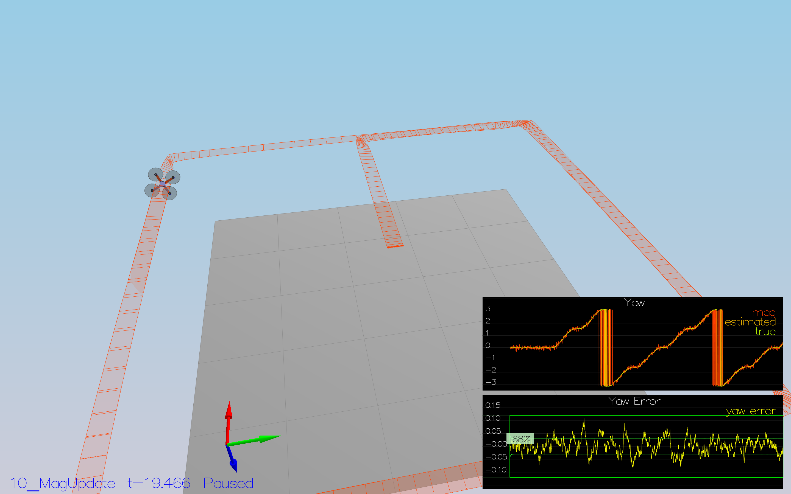


# Step 5: Closed Loop + GPS Update

## 5.1 - ideal estimator and ideal IMU

Running scenario 11 with both ideal estimator and ideal IMU results in this plot: 
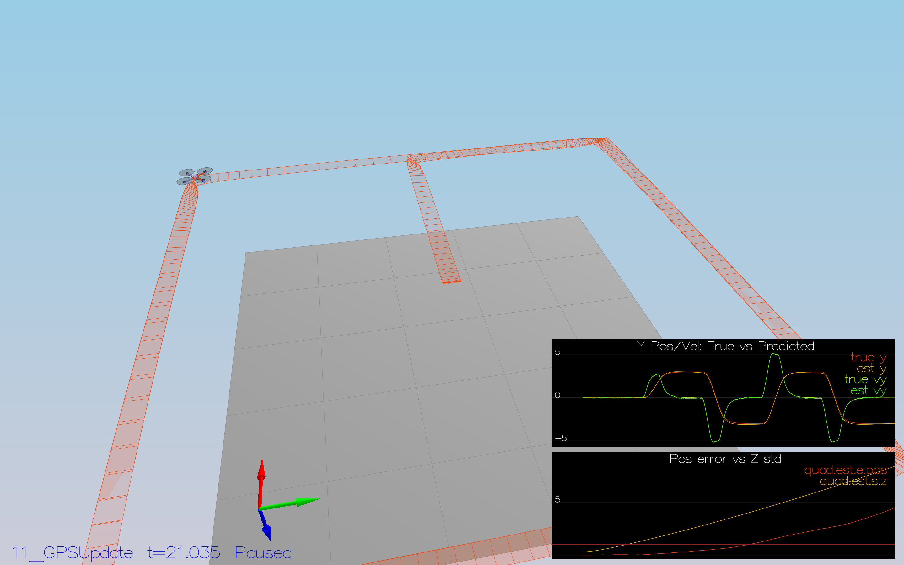
As described, the position error of the z coordinate slowly drifts away.

## 5.2 - using my own estimator (ideal IMU)
Switching it to using my own estimator but without an implemented GPS update step yields this result:
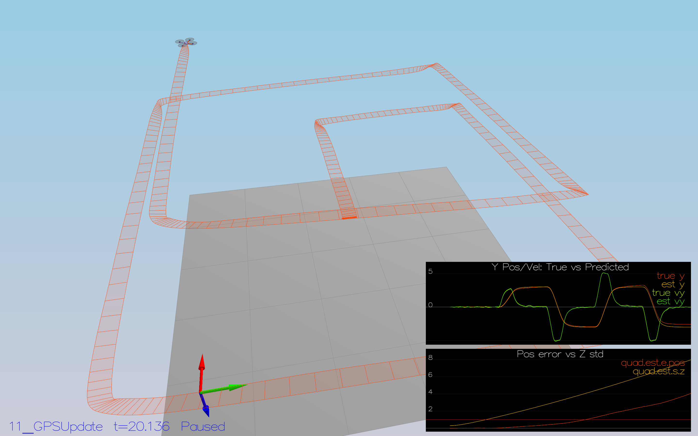
Without the GPS update, the control feedback for the height is missing and the drift in the estimator takes effect and is visible as a continuous drift in the z coordinate of the trajectory.

## 5.3 - own estimator, realistic IMU
Switching to using a realistic (i.e. noisy) IMU, but still not considering GPS measurements in the update step, yields this result:
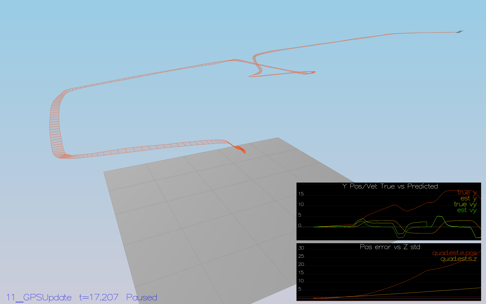
The trajectory is obviously very far off from the targeted one.

## 5.4 - tuning process noise model
Starting from this parameter configuration:
```
QPosXYStd = .05
QPosZStd = .05
QVelXYStd = .3
QVelZStd = .1
QYawStd = .09

# GPS measurement std deviations
GPSPosXYStd = 1
GPSPosZStd = 3
GPSVelXYStd = .3
GPSVelZStd = .3

# Magnetometer
MagYawStd = .1
```

Increasing QPosZStd to .25 and QVelZStd to .5 results in a better, but still not very good fitting error estimation, as can be seen in this plot:

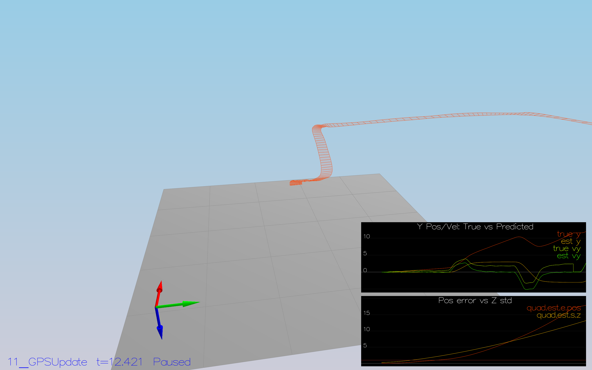


## 5.5. - implementing GPS Update step

Implementing the GPS update step follows section 7.3.1:

```
////////////////////////////// BEGIN STUDENT CODE ///////////////////////////
  // following section 7.3.1 from estimation paper
  hPrime(0,0) = 1.;
  hPrime(1,1) = 1.;
  hPrime(2,2) = 1.;
  hPrime(3,3) = 1.;
  hPrime(4,4) = 1.;
  hPrime(5,5) = 1.;

  // assign EKF state to zFromX without the yaw
  for(auto i = 0; i < 6; i++) {
      zFromX(i) = ekfState(i);
  }

  Update(z, hPrime, R_GPS, zFromX);
  
/////////////////////////////// END STUDENT CODE ////////////////////////////

```

With this update step in place, the resulting trajectory looks like this:


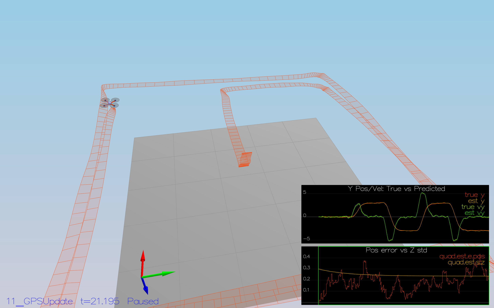

## Scenario 11.6 - further tuning
Now that the estimator is completely in place, I tried to further tune the parameters.
Increasing GPSPosZStd from 3 to 4 and GPSVelZStd from 0.3 to 0.4 resulted in a slight further improvement in position error:


# Step 6 - Insert your controller

Inserting both the controller code and the parameter file first results in erratic flight - as expected:
TODO

Tuning the parameters yields a not perfect, but sufficiently close flight along the target trajectory:


