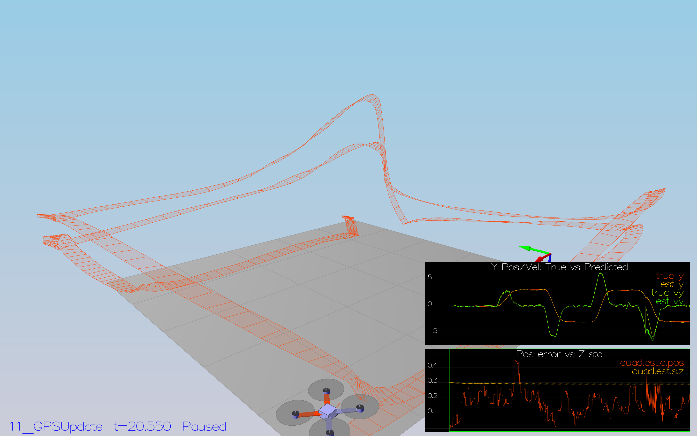
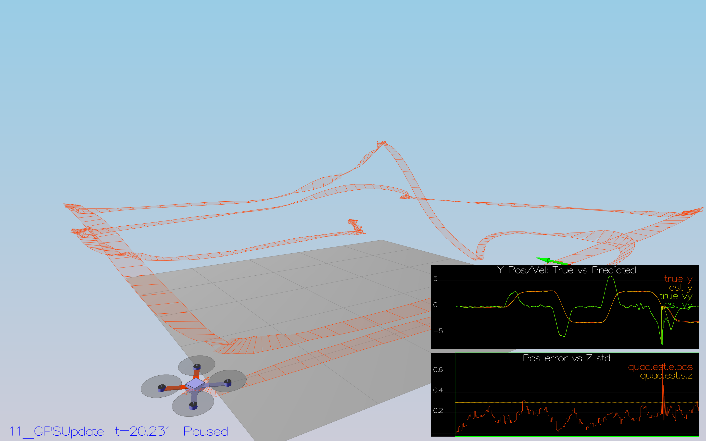
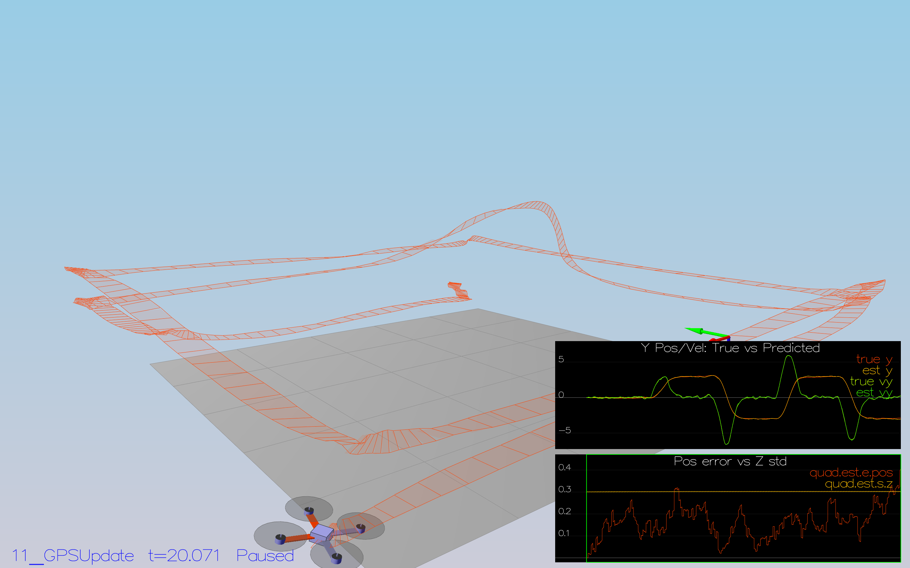
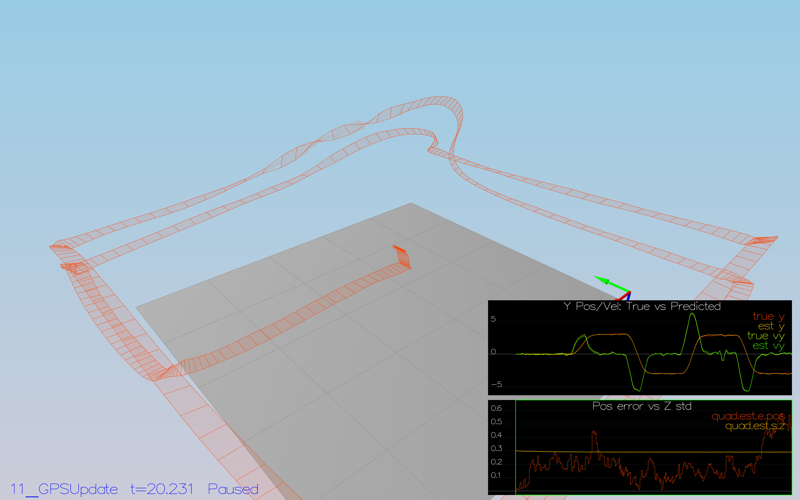
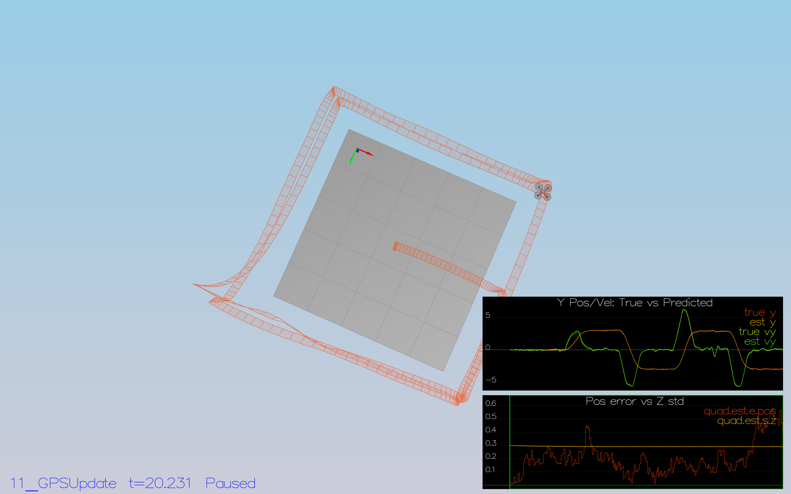
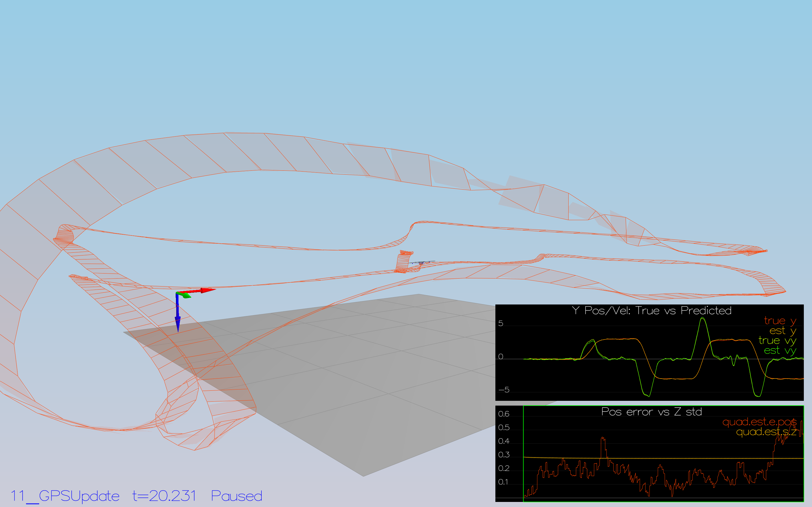

#  Writeup for the FCND-Estimation-CPP project

# Step 1: Sensor Noise (Scenario 6)

The task is to process the logged files from the simulation to calculate the standard deviation of the GPS X signal and the IMU Accelerometer X signal.

To accomplish this I wrote a little python script parsing and evaluating the log files:

```
import numpy as np

# calculate standard deviation from a series of measurements
# 1. gps x coordinate
gps_x_data = np.genfromtxt('Graph1.txt', delimiter=',', skip_header=1)
x = gps_x_data[:,1]
stdDev = np.std(x, axis = 0)
print(f'StdDev GPS X Position: {stdDev}')

# 2. accelerometer x acceleration
acc_ax_data = np.genfromtxt('Graph2.txt', delimiter=',', skip_header=1)
ax = acc_ax_data[:,1]
stdDev = np.std(ax, axis = 0)
print(f'StdDev Accelerometer X Acceleration: {stdDev}')
```
The result for a simulation of more than 10 seconds was:
* StdDev GPS X Position: 0.7017824842601307 (SimulatedSensors.txt: 0.7)
* StdDev Accelerometer ax: 0.5093821200191182 (SimulatedSensors.txt: 0.5) 

With these values inserted, the dashed lines turned green to signal that approx. 68% of the measurements are within the interval defined by the standard deviation:


# Step 2: Attitude Estimation (Scenario 7)

The task is to improve estimation with a better rate gyro attitude integration scheme in the complementary filter.

To do this, I implemented an integration based on a quaternion representation in the inertial frame.
Then, the body rate from the gyro can be integrated in that representation to get the updated pitch, roll, and yaw values.
The changed implementation part within QuadEstimatorEKF.cpp looks like this:
```
Quaternion<float> attitude = Quaternion<float>::FromEuler123_RPY(rollEst, pitchEst, ekfState(6));
attitude.IntegrateBodyRate(gyro, dtIMU);

float predictedPitch = attitude.Pitch();
float predictedRoll = attitude.Roll();
ekfState(6) = attitude.Yaw();
```

With this improved attitude estimation, the attitude error is within 0.1 rad for more than 3 seconds:


# Step 3: Prediction Step (Scenarios 8+9)

The task is to implement the prediction step of the Kalman filter.

## Step 3.1: transition function, state prediction (Scenario 8)
To accomplish this, the transition function in PredictState() calculates the pose and velocities using a simple integration, based on the assumption that dt is small:
```
////////////////////////////// BEGIN STUDENT CODE ///////////////////////////
  predictedState(0) = curState(0) + curState(3) * dt; // x = x + x_dot * dt
  predictedState(1) = curState(1) + curState(4) * dt; // y = y + y_dot * dt
  predictedState(2) = curState(2) + curState(5) * dt; // z = z + z_dot * dt
  
  // convert true acceleration from body frame to global/inertial frame
  V3F acc_inertial = attitude.Rotate_BtoI(accel);

  predictedState(3) = curState(3) + acc_inertial.x * dt; // change in velocity along x = a_x * dt
  predictedState(4) = curState(4) + acc_inertial.y * dt; // change in velocity along y = a_y * dt
  predictedState(5) = curState(5) + acc_inertial.z * dt - CONST_GRAVITY * dt; // change in velocity along z = a_z * dt - gravity_component

/////////////////////////////// END STUDENT CODE ////////////////////////////
```

With this state prediction, the estimator keeps track of the current state with only a reasonable drift:


## Step 3.2: Covariance prediction (Scenario 9)
To calculate the partial derivative of the body-to-global rotation matrix in the function GetRbgPrime(), I implemented equation (52) from the estimation paper:
```
////////////////////////////// BEGIN STUDENT CODE ///////////////////////////
  // implements equation (52) from the estimation paper (theta = pitch, phi = roll, psi = yaw)
  RbgPrime(0, 0) = -cos(pitch) * sin(yaw);
  RbgPrime(0, 1) = -sin(roll) * sin(pitch) * sin(yaw) - cos(roll) * cos(yaw);
  RbgPrime(0, 2) = -cos(roll) * sin(pitch) * sin(yaw) + sin(roll) * cos(yaw);

  RbgPrime(1, 0) = cos(pitch) * cos(yaw);
  RbgPrime(1, 1) = sin(roll) * sin(pitch) * cos(yaw) - cos(roll) * sin(yaw);
  RbgPrime(1, 2) = cos(roll) * sin(pitch) * cos(yaw) + sin(roll) * sin(yaw);
/////////////////////////////// END STUDENT CODE ////////////////////////////
```

With that function implemented, I implemented the Predict() function following equation(51) to predict the state covariance forward:

```
////////////////////////////// BEGIN STUDENT CODE ///////////////////////////
  // equation (51): calculate the derivative of transition function: G_t = g'(u_t, x_t, \Delta t) -> eq. 51
  gPrime(0,3) = dt;
  gPrime(1,4) = dt;
  gPrime(2,5) = dt;

  gPrime(3, 6) = (RbgPrime(0) * accel).sum() * dt;
  gPrime(4, 6) = (RbgPrime(1) * accel).sum() * dt;
  gPrime(5, 6) = (RbgPrime(2) * accel).sum() * dt;

  // calculate the covariance: \bar{\Sigma}_t = G_t\Sigma_{t-1}G_t^T + Q_t
  MatrixXf term_1 = gPrime * ekfCov;
  gPrime.transposeInPlace();
  ekfCov = term_1 * gPrime + Q;

/////////////////////////////// END STUDENT CODE ////////////////////////////
```

Tuning the parameters to these values:
````
QPosXYStd = .05
QVelXYStd = .3
````
results in a reasonable approximation of the errors regarding x and velocity of x, judging from these sample plots (I prolonged simulation time to 4 seconds to illustrate it better): 


# Step 4: Magnetometer Update (Scenario 10)
## Step 4.1: Tune the parameter QYawStd
In my simulation setting QYawStd to 0.01 resulted in this behavior, where the std deviation captures 81% of the values.


However, with my current tuning parameters configuration I could not reproduce the drift of the yaw error over time as described in the project readme:
```
QPosXYStd = .05
QPosZStd = .05
QVelXYStd = .3
QVelZStd = .1
QYawStd = .01
```
## Step 4.2: Implementation of Magnetometer Update

The implementation of the UpdateFromMag() method follows section 7.3.2 of the estimation paper:
```
////////////////////////////// BEGIN STUDENT CODE ///////////////////////////

  // section 7.3.2 estimation paper, equations 56 - 58
  // equation (58)
  hPrime(0, 6) = 1.;

  zFromX(0) = ekfState(6);
  float diffYaw = magYaw - ekfState(6);
  if ( diffYaw > F_PI ) {
      zFromX(0) += 2.f * F_PI;
  } else if ( diffYaw < -F_PI ) {
      zFromX(0) -= 2.f * F_PI;
  }
  
/////////////////////////////// END STUDENT CODE ////////////////////////////

```
For successfully completing the scenario, I had to tune th QYawStd parameter again to .09, so the resulting tuning parameters were:
```
QPosXYStd = .05
QPosZStd = .05
QVelXYStd = .3
QVelZStd = .1
QYawStd = .09

# GPS measurement std deviations
GPSPosXYStd = 1
# was: 3
GPSPosZStd = 300
GPSVelXYStd = .1
GPSVelZStd = .3
```
This configuration yielded a successful completion of scenario 10:


# Step 5: Closed Loop + GPS Update (Scenario 11)

## Step 5.1: Ideal estimator and ideal IMU

Running scenario 11 with both ideal estimator and ideal IMU results in this plot: 

As described, the position error of the z coordinate slowly drifts away.

## Step 5.2: Using my own estimator (but still ideal IMU)
Switching it to using my own estimator but without an implemented GPS update step yields this result:

Without the GPS update, the control feedback for the height is missing and the drift in the estimator takes effect and is visible as a continuous drift in the z coordinate of the trajectory.

## Step 5.3: Own estimator and realistic IMU
Switching to using a realistic (i.e. noisy) IMU, but still not considering GPS measurements in the update step, yields this result:

The trajectory is obviously very far off from the targeted one, still missing an effective correction for drift errors.

## Step 5.4: Tuning process noise model
Starting from this parameter configuration:
```
QPosXYStd = .05
QPosZStd = .05
QVelXYStd = .3
QVelZStd = .1
QYawStd = .09

# GPS measurement std deviations
GPSPosXYStd = 1
GPSPosZStd = 3
GPSVelXYStd = .3
GPSVelZStd = .3

# Magnetometer
MagYawStd = .1
```

Increasing QPosZStd to .25 and QVelZStd to .5 results in a better, but still not very good fitting error estimation, as can be seen in this plot:


## Step 5.5: Implementing GPS Update step

Implementing the GPS update step follows section 7.3.1:

```
////////////////////////////// BEGIN STUDENT CODE ///////////////////////////
  
  // following section 7.3.1 from estimation paper
  hPrime(0,0) = 1.;
  hPrime(1,1) = 1.;
  hPrime(2,2) = 1.;
  hPrime(3,3) = 1.;
  hPrime(4,4) = 1.;
  hPrime(5,5) = 1.;

  // assign EKF state to zFromX (without yaw)
  for(auto i = 0; i < 6; i++) {
      zFromX(i) = ekfState(i);
  }
  
/////////////////////////////// END STUDENT CODE ////////////////////////////
```

With this update step in place, the drone can finally compensate for continuous drift errors and the resulting trajectory looks like this:


## Step 5.6: Further tuning
Now that the estimator is completely in place, I tried to finetune the parameters.
Increasing GPSPosZStd from 3 to 4 and GPSVelZStd from 0.3 to 0.4 resulted in a very slight further improvement in position error:


# Step 6 - Insert your controller (Scenario 11)

## Step 6.1 Inserting my controller and rough de-tuning
Inserting both the controller code and parameter file from my previous project first resulted in an erratic flight - as was already indicated as very likely in the description.

Performing a first de-tuning round for the parameters I achieved a sufficiently close flight along the target trajectory fulfilling the formal scenario criteria of keeping an estimated position error of < 1m, but with a poor performance at the second corner of the square (hitting ground as a consequence):



These were the roughly re-tuned parameters of my controller which I took as a baseline for further parameter tuning:
```
# Position control gains
kpPosXY = 22
kpPosZ = 16
KiPosZ = 25

# Velocity control gains
kpVelXY = 10
kpVelZ = 9

# Angle control gains
kpBank = 15
kpYaw = 2

# Angle rate gains
kpPQR = 70, 70, 6
```

## Step 6.2 Fine-tuning of parameter sets
To improve the performance, I followed the advice to further tune my setup in a two-step process.
Setting the IMU noise model values to 0 again I reverted to a perfect IMU sensor, still yielding more or less the same performance, indicating that the performance issues may be primarily related to the controller (as opposed to estimator):



With a perfect IMU sensor, I fine-tuned the parameters to
```
# Position control gains
kpPosXY = 22
kpPosZ = 16
KiPosZ = 14

# Velocity control gains
kpVelXY = 10
kpVelZ = 8

# Angle control gains
kpBank = 15
kpYaw = 2

# Angle rate gains
kpPQR = 70, 70, 8
```

Yielding this significantly improved performance (note: still with perfect IMU sensor):



Now activating the realistic IMU again and performing some more tuning sessions of both controller and estimator parameters I managed to finally arrive at this performance (with realistic IMU sensor):



...using this final parameter set for the controller:

```
[QuadControlParams] 

UseIdealEstimator=1

# Physical properties
Mass = 0.5
L = 0.17
Ixx = 0.0023
Iyy = 0.0023
Izz = 0.0046
kappa = 0.016
minMotorThrust = .1
maxMotorThrust = 4.5

# Position control gains
kpPosXY = 22
kpPosZ = 16
KiPosZ = 15

# Velocity control gains
kpVelXY = 10
kpVelZ = 7

# Angle control gains
kpBank = 15
kpYaw = 2.5

# Angle rate gains
kpPQR = 68, 68, 8

# limits
maxAscentRate = 5
maxDescentRate = 2
maxSpeedXY = 5
maxHorizAccel = 12
maxTiltAngle = .7
```

...and for the estimator:

```
[QuadEstimatorEKF]
InitState = 0, 0, -1, 0, 0, 0, 0
InitStdDevs = .1, .1, .3, .1, .1, .3, .05

# Process noise model
# note that the process covariance matrix is diag(pow(QStd,2))*dtIMU

QPosXYStd = .05
QPosZStd = .05
QVelXYStd = .3
QVelZStd = .1
QYawStd = .09

# GPS measurement std deviations
GPSPosXYStd = 1
GPSPosZStd = 2
GPSVelXYStd = .3
GPSVelZStd = .4

# Magnetometer
MagYawStd = .1

dtIMU = 0.002
attitudeTau = 100
```
## Step 6.3 Analysis of the final result

The position control regarding x and y position follows closely the square trajectory, as can be illustrated from a top view onto the trajectory:


However, the altitude control still exhibits a significant error in the z coordinate around the second corner (especially in the second round), as can be seen in the relevant graphed error curves as well as a close-up look at the trajectory of the second corner:


I did not succeed in further improving this and finding the root cause of this, whether it's an issue in my implementation (I double-checked my implementation of the altitude controller) or a parameter tuning issue - any feedback on possible improvements is appreciated. Control for the remaining trajectory appears a lot better, but in the second corner the combination of attitude and altitude control remains challenging for the drone even with a lot of tuning efforts.

